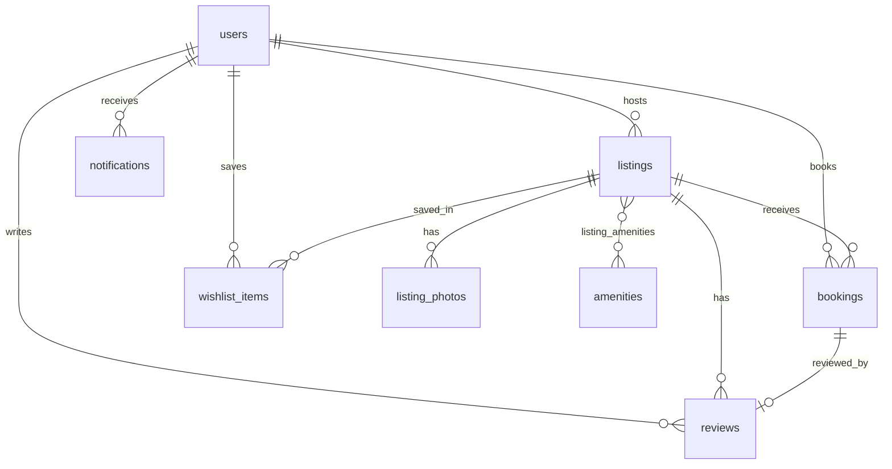

# PRD — Airbnb Web App Clone (SDE Fullstack Assignment)

> **Status:** Final, implementation-ready
> **Budget:** ~24 hours (AI-assisted)
> **Source of truth:** This document. If code and PRD disagree, fix the code or update the PRD in the same commit.
> **Companion file:** `MASTER_PROMPT.md` (segmented build instructions for an AI coding agent)

---

## 0. How to read this document

- Every requirement has an ID (`F-xx`, `AC-xx`) so it can be traced from the assignment → feature → API → screen → test.
- Priority tiers:
  - **P0**: assignment "Must Have". Cannot ship without it.
  - **P1**: assignment "Airbnb Experience" fidelity (UI/UX match, toasts, wishlist, modals, filters).
  - **P2**: assignment "Bonus" items. Built last, in order of value (see §20 cut order).
- Decisions are stated, not offered as options. Assumptions are listed in §2.

---

## 1. Product Overview

### 1.1 Problem
Travelers need to find a stay that is actually free on their dates and book it without friction. Hosts need to publish properties, control their details, and see who has booked them. The product recreates the Airbnb marketplace experience (photo-forward browse, search, listing detail, booking, host tools) with real persistence and real authentication.

### 1.2 Target users
| User | Need |
|---|---|
| Traveler (guest) | Discover, filter, compare, book, manage trips, save favorites, review a completed stay |
| Host | Create and manage listings, see reservations and earnings snapshot |
| Evaluator | Open the app and immediately see a populated, polished, working marketplace |

### 1.3 Roles
| Role | Capabilities |
|---|---|
| Visitor (logged out) | Browse, search, view listings, view reviews. Prompted to log in when booking or saving |
| Guest (default on signup) | Everything a visitor can do, plus book, cancel, wishlist, review completed stays, notifications |
| Host (guest who enabled hosting) | Everything a guest can do, plus listing CRUD, host dashboard, reservations, image upload |

- No admin role. A host cannot book their own listing (server-enforced).
- "Guest vs host" is a stored `users.role` value verified on the server for every protected endpoint.

### 1.4 Goals
1. All assignment must-haves work end to end and persist.
2. UI and UX closely match Airbnb: layout, spacing, type, interactions.
3. Clean relational schema, clean REST API, clean modular code.
4. Immediately usable via seeded data.
5. Every bonus item delivered (see traceability matrix).

### 1.5 Non-goals (explicit)
Real payments, real messaging, identity verification, email delivery, password reset, host-side date blocking, multi-currency, i18n, admin panel. Messaging and identity verification exist only as "Coming Soon" surfaces as the assignment permits.

### 1.6 Traceability matrix (assignment → this PRD)

| Assignment requirement | ID | Tier | Segment |
|---|---|---|---|
| Grid of listing cards (photo, title, location, price, rating) | F-01 | P0 | S5 |
| Search bar (location + dates + guests) | F-02 | P0 | S3, S5 |
| Category / filter row (price, type, amenities) | F-03 | P0 | S3, S5 |
| Pagination or infinite scroll | F-04 | P0 | S3, S5 |
| Photo gallery | F-05 | P0 | S7 |
| Title, description, location, amenities, host info | F-06 | P0 | S7 |
| Availability calendar / date-range picker | F-07 | P0 | S6, S7 |
| Price breakdown (nightly × nights + fees) | F-08 | P0 | S6, S7 |
| Reviews section | F-09 | P0 | S7, S10 |
| Date range + guest count validation, no overlaps | F-10 | P0 | S6 |
| Booking summary + mocked checkout/confirmation | F-11 | P0 | S6, S7 |
| My Trips | F-12 | P0 | S7 |
| Bookings persist and block dates | F-13 | P0 | S6 |
| Create listing (title, description, photos URL/upload, price, location, amenities) | F-14 | P0 | S8, S9 |
| Edit and delete listings | F-15 | P0 | S8, S9 |
| Host dashboard: owned listings and bookings | F-16 | P0 | S8, S9 |
| Nav/layout, cards, galleries, date pickers, modals | F-17 | P1 | S4, S5, S7 |
| Notifications / toasts | F-18 | P1 | S4, S6, S11 |
| Wishlist / favorites | F-19 | P1 | S3, S5, S11 |
| Placeholders: payments, messaging, map pricing pins, identity, simplified auth | F-20 | P1 | S7, S11 |
| Guest vs host notion | F-21 | P0 | S2 |
| Interactive map with listing pins | F-22 | P2 | S12 |
| Leave a review after completed stay | F-23 | P2 | S10 |
| Superhost badges / ratings aggregation | F-24 | P2 | S10 |
| Image upload to cloud storage | F-25 | P2 | S8 (adapter), S14 |
| Dark mode | F-26 | P2 | S13 |
| Responsive design (mobile, tablet, desktop) | F-27 | P2 (built from S4 on) | S4–S13 |
| Seeded DB (listings, hosts, bookings) | F-28 | P0 | S1 |
| README (setup, stack, architecture, schema, assumptions) | F-29 | P0 | S14 |
| Hosted demo + public repo | F-30 | P0 | S14 |

---

## 2. Assumptions & Decisions Log

| # | Decision |
|---|---|
| D1 | Auth is **real** (bcrypt + JWT in httpOnly cookie) even though the brief allows mocking. |
| D2 | One currency, USD. Money stored as integer cents. Currency symbol/formatter centralized in `lib/format.ts` and `app/core/money.py`. |
| D3 | Booking is **instant-confirm**. No host approval step. |
| D4 | Dates are date-only (`YYYY-MM-DD`), no time zones. "Today" is the server's UTC date and is exposed by `GET /api/meta` so the client never computes its own "today" for rules. |
| D5 | Date ranges are half-open `[check_in, check_out)`. Same-day turnover is allowed. |
| D6 | Payment is a **mocked processor**: card form with client-side tokenization stub; the real card number never leaves the browser; server `charge()` approves or declines based on the token. |
| D7 | Images: hosts can paste URLs **or** upload files. Uploads go through a `StorageService` interface; default driver is local disk (`/uploads`), optional Cloudinary driver via env flag. |
| D8 | Maps use Leaflet + OpenStreetMap tiles (no API key). |
| D9 | Brand voice: copy and layout follow Airbnb; the logo is a custom SVG mark + wordmark created for this project. |
| D10 | Frontend talks to the backend only through a same-origin `/api/*` rewrite so cookies are first-party; no CORS in production. |
| D11 | Wishlist is a single "Saved" list per user (simple, as allowed). |
| D12 | Cancellation policy is a single fixed "Flexible" policy (see §10.4). |
| D13 | Render free-tier disk is ephemeral: the app auto-seeds if the DB is empty on startup; uploaded files may vanish unless Cloudinary is configured. Documented in README. |
| D14 | Password reset, email verification and profile photo upload for users are out of scope. |
| D15 | Exact pixel parity with Airbnb is not achievable (proprietary font and assets). Target: same layout, proportions, spacing rhythm, colors, interaction patterns. Font is Inter. |

---

## 3. Design System

### 3.1 Tokens (CSS variables, mapped in `tailwind.config.ts`)

**Light theme**
| Token | Value | Use |
|---|---|---|
| `--bg` | `#FFFFFF` | Page |
| `--surface` | `#F7F7F7` | Footer, subtle panels |
| `--text` | `#222222` | Primary text |
| `--text-muted` | `#6A6A6A` | Secondary text (4.5:1 on white) |
| `--border` | `#DDDDDD` | Dividers, inputs |
| `--border-strong` | `#B0B0B0` | Input hover |
| `--brand` | `#FF385C` | Search button, hearts (filled), brand accents |
| `--brand-grad` | `linear-gradient(to right,#E61E4D 0%,#E31C5F 50%,#D70466 100%)` | **Only** Reserve / Confirm-and-pay buttons |
| `--error` | `#C13515` | Errors |
| `--success` | `#008A05` | Success |
| `--focus` | `#222222` | 3px focus ring with 2px offset |

**Dark theme** (F-26): `--bg #121212`, `--surface #1C1C1C`, `--text #F2F2F2`, `--text-muted #A8A8A8`, `--border #3A3A3A`, brand unchanged. Applied via `data-theme="dark"` plus `prefers-color-scheme` default, user override persisted in `localStorage` (UI preference only, not data).

### 3.2 Typography (Inter via `next/font`)
| Style | Size / weight / line |
|---|---|
| Page title (H1) | 32px / 600 / 36px |
| Section title (H2) | 22px / 600 / 26px |
| Card title | 15px / 600 / 20px |
| Body | 16px / 400 / 24px |
| Secondary / meta | 14px / 400 / 18px |
| Caption / category label | 12px / 600 / 16px |
Letter-spacing −0.01em on headings.

### 3.3 Spacing, radius, elevation
- 4px base scale (4, 8, 12, 16, 24, 32, 48, 64, 80).
- Page horizontal padding: 80px (≥1128), 40px (744–1127), 24px (<744).
- Radius: card image 12, buttons/inputs 8, modals 12 (desktop) / full-sheet (mobile), pills 9999.
- Shadows (only two): `--shadow-sm: 0 1px 2px rgba(0,0,0,.08), 0 4px 12px rgba(0,0,0,.05)` (dropdowns, search pill) and `--shadow-lg: 0 6px 16px rgba(0,0,0,.12)` (booking card, modals).
- No glassmorphism, no decorative gradients, no illustrations. Icons: `lucide-react` only.

### 3.4 Layout grid (listing cards)
| Viewport | Columns |
|---|---|
| <550 | 1 |
| 550–743 | 2 |
| 744–1127 | 3 |
| 1128–1439 | 4 |
| 1440–1759 | 5 |
| ≥1760 | 6 |
Gap: 24px column, 40px row.

### 3.5 Component specs (must match Airbnb patterns)

**Header** (sticky, 80px, white, bottom border on scroll)
- Left: logo. Center: search bar. Right: "Airbnb your home" (or "Switch to hosting" if host), notification bell (logged in), avatar menu pill (hamburger + avatar, border, shadow on hover).
- Expanded search bar (66px, pill, 3 segments + circular brand search button): **Where** | **Check in** | **Check out** | **Who**. Hover on a segment shows `--surface` highlight pill; active segment shows white pill with shadow; popovers drop below (destination suggestions, two-month calendar, guest steppers).
- Collapsed (after scroll >0 or on non-home pages): 48px pill "Anywhere | Any week | Add guests" + search icon; clicking expands.
- Mobile: single pill "Where to? · Anywhere · Any week · Add guests" opening a full-screen stepped search sheet (Where → When → Who).

**Category bar** (sticky below header, 80px)
- Horizontal scroll with fade+arrow buttons at the edges, 14 categories (icon 24px + 12px/600 label), active = 2px bottom border `--text` and full-opacity icon; inactive = `--text-muted`. Right: "Filters" button (sliders icon, 1px border, radius 12). Active filter count shown as a dark badge.

**Listing card**
- Image 1:1 (use `aspect-ratio: 20/19`), radius 12, multi-image carousel (first 5 photos): arrows (32px white circles) on hover, 5 dots. Heart top-right (white outline, translucent dark fill; filled `--brand` when saved). "Guest favorite" pill top-left if `rating_avg ≥ 4.8 && rating_count ≥ 5`.
- Text block: row1 `City, Country` 15/600 + right-aligned `★ 4.92` ; row2 muted property description (e.g. "Entire home · 3 beds"); row3 muted dates when searching; row4 `$142` 600 + ` night` (or ` for 5 nights` + total when dates chosen).

**Photo grid (detail)**: 400px high, 2fr + (2×2 grid of 1fr), 8px gap, outer radius 12, "Show all photos" button bottom-right. Click opens a full-screen gallery modal (scrollable stack, close X, keyboard arrows/Esc). Mobile: swipeable carousel with "1 / 5" counter.

**Booking card (sticky, top: 144px, width 372px)**: border `--border`, radius 12, padding 24, `--shadow-lg`. Contents: price line, date/guest 2×2 bordered box (opens popovers), Reserve (`--brand-grad`, 48px), "You won't be charged yet", breakdown rows, top-bordered Total row. Mobile: fixed bottom bar (price + dates summary + Reserve).

**Modal**: 64px header (close X left, centered 16/600 title, bottom border), scrollable body, sticky footer for actions. Focus trap, Esc closes, backdrop click closes (unless dirty form). Mobile: bottom sheet or full-screen.

**Buttons**: Primary dark (`--text` bg, white text), Brand (gradient), Secondary (white, 1px `--text` border), Tertiary (underlined text). Height 48, radius 8, 16/500. Disabled = 40% opacity, `aria-disabled`. Loading = inline spinner, width preserved.

**Toast**: dark (`#222`) snackbar, bottom-center desktop, bottom-above-nav mobile, 4s auto-dismiss, pause on hover, optional action link ("View trip"), `role="status"` (errors use `role="alert"`).

**Skeleton**: shimmer-free flat `--surface` blocks matching exact dimensions of the real component.

**Footer**: `--surface` bg, 3 link columns (Support, Hosting, Airbnb) + bottom bar (© year, Privacy, Terms, Sitemap). Every link points to a real route or a Coming Soon page. No dead `#` links.

**Mobile bottom nav** (<744): Explore · Wishlists · Trips · Profile (or Log in). 64px, active icon brand-colored. Hidden on detail/checkout pages.

### 3.6 States (global rules)
- **Loading**: skeletons for grids and detail; spinners inside buttons; never a blank screen.
- **Empty**: icon-free text, one sentence + one CTA.
- **Error**: inline message + "Try again" button (refetch). 404 and 500 pages styled to match.
- **Success**: toast and/or confirmation page.

### 3.7 Accessibility
Visible `<label>` on all inputs; `aria-invalid` + `aria-describedby` on errors; focus moves to first error on failed submit; 3px visible focus ring; modals trap focus, restore focus to trigger; calendar fully keyboard operable (react-day-picker); contrast ≥ 4.5:1 text, 3:1 UI; `alt` on all images; heart button `aria-pressed` with label "Save <title> to wishlist"; `prefers-reduced-motion` disables carousel/skeleton animation; touch targets ≥ 44px.

---

## 4. Information Architecture & Routes

### 4.1 Route table (Next.js App Router)

| Route | Access | Purpose |
|---|---|---|
| `/` | Public | Explore (grid, categories, search, filters, map toggle). Query: `location, lat?, lng?, checkIn, checkOut, adults, children, infants, pets, category, minPrice, maxPrice, roomType, propertyType, bedrooms, beds, baths, amenities, view=map` |
| `/rooms/[id]` | Public | Listing detail. Query: `checkIn, checkOut, adults, children, infants, pets` carried through |
| `/login`, `/signup` | Public only (redirect if authed) | Auth pages; also available as modals from avatar menu |
| `/book/[id]` | Auth (not owner) | Checkout. Query: `checkIn, checkOut, adults, children, infants, pets` |
| `/trips` | Auth | My Trips (Upcoming / Past / Cancelled) |
| `/trips/[bookingId]` | Auth (guest or listing host) | Confirmation / trip detail, cancel, leave review |
| `/wishlists` | Auth | Saved listings grid |
| `/notifications` | Auth | Full notification list (bell dropdown is the quick view) |
| `/account` | Auth | Profile summary, become-host, identity verification (Coming Soon) |
| `/messages` | Auth | Coming Soon |
| `/hosting` | Host | Dashboard: Today + stats + upcoming reservations |
| `/hosting/listings` | Host | Owned listings table with Edit/Delete |
| `/hosting/listings/new` | Host | Create listing |
| `/hosting/listings/[id]/edit` | Host (owner) | Edit listing |
| `/hosting/reservations` | Host | Reservations on own listings |
| `/become-a-host` | Auth | Explains hosting, confirm button → role upgrade → redirect to `/hosting/listings/new` |
| `/coming-soon/[slug]` | Public | Placeholder for Help, Terms, Privacy, Sitemap, Gift cards etc. (title derived from slug) |
| `/not-found`, `/error` | Public | Styled 404 / 500 |

### 4.2 Avatar menu
- Logged out: **Sign up**, **Log in**, divider, **Airbnb your home** (→ login with `next`), **Help Center** (Coming Soon).
- Guest: **Messages** (Coming Soon page), **Trips**, **Wishlists**, divider, **Airbnb your home** (→ `/become-a-host`), **Account**, **Appearance** (Light/Dark/System), **Log out**.
- Host: **Messages**, **Trips**, **Wishlists**, divider, **Manage listings** (→ `/hosting`), **Account**, **Appearance**, **Log out**.

### 4.3 Route protection
1. `middleware.ts` (UX layer): if no session cookie on a protected path, redirect to `/login?next=<path>`; if cookie present on `/login` or `/signup`, redirect to `/`.
2. API (authoritative layer): every protected endpoint enforces authentication and role/ownership.
3. Role-specific pages (`/hosting/*`) additionally call `/api/auth/me` in a server component and redirect non-hosts to `/become-a-host`.

---

## 5. User Flows

### 5.1 Main journey (guest)
Home → choose category or search (where/when/who) → grid updates (URL changes) → open listing (query preserved) → pick dates (booked dates disabled) → set guests → quote appears → **Reserve** → (if logged out: login with `next`, returns to same dates) → checkout (review trip, pay with mock card) → **Confirm and pay** → confirmation page → toast "Reservation confirmed" with "View trip" → appears in My Trips → dates now blocked for everyone.

### 5.2 Onboarding
Signup (name, email, password) → auto-login (cookie set) → redirected to `next` or `/`. No email verification. Header immediately shows avatar menu.

### 5.3 Host flow
Avatar menu "Airbnb your home" → `/become-a-host` → "Get started" (POST become-host; cookie reissued) → `/hosting/listings/new` → form (with image upload/URL) → save → toast "Listing created" → `/hosting/listings` → listing visible on Explore → reservations appear in `/hosting/reservations` and in the host's notifications.

### 5.4 Post-stay review flow
After `check_out < today` on a confirmed booking: Trips → Past → "Leave a review" → six star rows + comment → submit → listing rating aggregates update; host notified.

### 5.5 Failure paths
| Failure | Behavior |
|---|---|
| Dates taken at submit time | 409 `DATES_UNAVAILABLE` → error toast, availability refetched, selected dates cleared, user stays on listing/checkout with a link back |
| Payment declined (test card `4000 0000 0000 0002`) | 402 `PAYMENT_DECLINED` → inline banner on checkout, no booking created, form retained |
| Session expired | 401 → redirect `/login?next=…` with toast "Please log in again" |
| Validation error | Inline per-field errors, focus first invalid field |
| Network failure | Section-level error with "Try again" |
| Forbidden action | 403 → toast "You don't have permission to do that" and redirect to a safe page |
| Listing deleted/not found | Styled 404 "Listing not found" |

### 5.6 Edge cases
- Same-day turnover allowed (`check_in == other.check_out`).
- Min nights default 1, max 30 (per-listing override fields exist).
- Check-in ≥ today (server date). Booking window ≤ 365 days ahead.
- Guests: `adults + children ≤ max_guests`, `adults ≥ 1`, `infants ≤ 5`, `pets ≤ 5` and only if `pets_allowed`.
- Host cannot book own listing (UI hides Reserve, API returns 403 `OWN_LISTING`).
- Deleting a listing with future confirmed bookings → 409 `LISTING_HAS_UPCOMING_BOOKINGS`. Otherwise soft delete; past bookings remain visible with listing snapshot.
- Cancelling twice → 409 `ALREADY_CANCELLED`. Cancelling after check-in → 409 `CANNOT_CANCEL_STARTED`.
- Double-click on "Confirm and pay": button disabled while pending; server returns the existing booking if the same guest booked the same listing/dates within 60 seconds (idempotent).
- Browser refresh on checkout preserves state (all inputs are in the URL).
- Wishlisting while logged out opens the login modal and completes the save after login.
- Review: only for completed, confirmed bookings by the booking's guest; one review per booking.
- Listing with zero reviews shows "New" instead of a rating.

---

## 6. Screens

For each screen: **Purpose · Layout · Components · Primary CTA · Data · Interactions · Validation · States**

### 6.1 Explore (`/`)
- **Purpose:** Discover and search listings.
- **Layout:** Header → CategoryBar (sticky) → grid (§3.4) → infinite-scroll sentinel → footer. Floating "Show map" pill (bottom-center) toggles split view (list left 55%, map right 45%, sticky) on desktop; full-screen map on mobile.
- **Components:** Header+SearchBar, CategoryBar, FilterModal, ListingCard, ListingCardSkeleton, EmptyState, MapView (P2), Toast.
- **Primary CTA:** Open a listing (card click). Secondary: Search, Filters.
- **Data:** Per card: photos (≤5), city/country, room/property summary, beds, price/night (or total for dates), rating, guest-favorite flag, saved state.
- **Interactions:** Category click sets `category` (click active again clears). Search submit pushes URL params. Filters modal shows live "Show N places" count from `/listings/count` (debounced 300ms). Heart toggles wishlist optimistically with rollback on failure. Infinite scroll loads next page (page size 20); visible "Show more" button as fallback; "Loading more…" state at the bottom.
- **Filter modal contents:** price range (dual slider + min/max inputs + histogram), room type (Any / Room / Entire home), rooms and beds (bedrooms, beds, bathrooms steppers "Any, 1+, 2+…"), property type (multi chip select), amenities (checkbox grid, "Show more"), Guest-favorite/Superhost toggle. Footer: "Clear all" + "Show N places".
- **Validation:** check-out > check-in; minPrice ≤ maxPrice; guests ≥ 1 adults; invalid URL params are ignored, not crashing.
- **States:** skeleton grid (12); empty "No exact matches" + "Clear filters" button; error "Something went wrong" + "Try again"; append-error row at the bottom with retry.

### 6.2 Listing Detail (`/rooms/[id]`)
- **Purpose:** Evaluate and reserve.
- **Layout:** Title row (H1, rating, location, Share = copy link toast, Save) → PhotoGrid → two columns. Left: summary ("Entire home in City, Country", guests · bedrooms · beds · baths), host row (avatar, "Hosted by X", Superhost badge), divider sections: description (clamped to 5 lines + "Show more" modal), "What this place offers" (first 10 + "Show all N amenities" modal), "N nights in City" calendar (two months) with "Clear dates", reviews (summary, six category bars, list, "Show all reviews" modal), "Where you'll be" map (P2), "Meet your host" card, "Things to know" (house rules, check-in/out, cancellation policy). Right: sticky BookingCard.
- **Components:** PhotoGrid, GalleryModal, DateRangePicker, GuestPicker, BookingCard, AmenityList, ReviewList, RatingSummary, HostCard, MapView, MobileBookingBar.
- **Primary CTA:** Reserve.
- **Data:** full listing, photos, amenities, host (name, joined year, superhost, listing count), reviews (paginated), availability (booked ranges for 12 months), quote.
- **Interactions:** Choosing dates in either calendar syncs both and the URL; invalid selections (range spanning a booked night) are prevented in the picker (days between disabled start and selection are rejected with inline hint "Some of these dates are unavailable"). Guest popover has Adults/Children/Infants/Pets steppers with limits and "This place has a maximum of N guests" note. Quote fetched (debounced) on valid dates; Reserve navigates to `/book/[id]?…`.
- **Validation:** same rules as §10.1 (client mirrors server; server is authoritative).
- **States:** skeleton; 404; Reserve disabled with label "Check availability" until dates valid, then "Reserve"; owner view replaces BookingCard with "Edit listing" and "Manage" links; logged-out Reserve → login with `next`.

### 6.3 Checkout (`/book/[id]`)
- **Purpose:** Review and confirm a reservation.
- **Layout:** Back arrow + "Confirm and pay". Left column: **Your trip** (Dates, Guests, each with "Edit" returning to listing), **Pay with** (card form: number, expiry, CVC, ZIP, country; helper "Demo payment. Use 4242 4242 4242 4242"), **Cancellation policy** text, ground rules line, **Confirm and pay** button (brand gradient). Right: sticky summary card (thumbnail, title, rating, price breakdown, total).
- **Primary CTA:** Confirm and pay.
- **Data:** listing summary, dates, guests, server quote (re-fetched on load).
- **Validation:** card number Luhn + length, expiry not in the past, CVC 3–4 digits, ZIP non-empty, all inline; trip rules re-validated on load (invalid → redirect to listing with toast).
- **States:** loading skeleton; quote error with retry; 409 → banner "Those dates are no longer available" + link back; 402 → banner "Your card was declined" ; success → `/trips/[id]?new=1`.

### 6.4 Trip detail / Confirmation (`/trips/[bookingId]`)
- **Purpose:** Proof of booking and management.
- **Layout:** Success header (when `?new=1`: "Your reservation is confirmed"), listing photo + title, dates, check-in/out times, address, guests, price breakdown, payment (brand ••••last4), cancellation policy, confirmation code (e.g. `HM4K9Z2QXA`).
- **Primary CTA:** "View my trips". Secondary: Cancel reservation (upcoming only), Leave a review (completed only), View listing.
- **Interactions:** Cancel opens confirm modal showing refund amount computed server-side; success toast; status badge updates.
- **States:** 403/404 for non-participants; skeleton; error with retry.

### 6.5 My Trips (`/trips`)
- Tabs: **Upcoming**, **Past**, **Cancelled** (counts in labels). Row/card: photo, title, city, dates, total, status badge (Confirmed / Completed / Cancelled), actions (View, Cancel, Review). Sorted by check-in (asc upcoming, desc past).
- **Empty:** "No trips booked… yet!" + "Start searching". **Error:** retry.

### 6.6 Wishlists (`/wishlists`)
- Grid of ListingCards (hearts filled; unhearting removes with an "Undo" toast). **Empty:** "Create your first wishlist" copy + "Start exploring". Count in header.

### 6.7 Login / Signup (`/login`, `/signup`)
- Centered 568px card (Airbnb-style): "Log in or sign up" header, fields (name on signup, email, password with show/hide), primary dark button, link to the alternate page.
- **Validation:** email format; password ≥ 8 chars with ≥1 letter and ≥1 number (strength hint); name 2–60 chars.
- **Server errors:** login → generic "Incorrect email or password"; signup duplicate → inline email error "An account with this email already exists"; rate limit → "Too many attempts. Try again in a minute."
- **Modal variant** shares the same form component.

### 6.8 Become a Host (`/become-a-host`)
- Short explainer (3 steps: describe, add photos, publish), "Get started" button → `POST /users/me/become-host` → redirect to `/hosting/listings/new`. Already hosts are redirected to `/hosting`.

### 6.9 Hosting Dashboard (`/hosting`)
- **Today:** cards "Checking out (N)", "Currently hosting (N)", "Arriving soon (N)", "Upcoming (N)" with guest name + listing + dates. **Stats:** total listings, upcoming bookings, confirmed revenue (30d, from stored totals minus service fee), average rating. CTA: "Create listing".
- Sub-nav tabs: Today · Listings · Reservations.
- **Empty:** no listings → "Create your first listing".

### 6.10 Host Listings (`/hosting/listings`)
- Table (cards on mobile): thumbnail, title, location, price, rating, upcoming bookings, actions Edit / View / Delete. Delete opens modal; 409 shows "This listing has upcoming reservations. Wait until they finish or contact the guests."

### 6.11 Listing Form (new/edit)
- Stepless single page with sticky "Save" bar, sections: **Basics** (title 5–80, description 20–2000 with counter, category, property type, room type), **Location** (address line, city, country, latitude/longitude auto-filled from a built-in city lookup and editable), **Capacity** (max guests 1–16, bedrooms 0–20, beds 1–30, baths 0.5–20, pets allowed), **Photos** (drag/drop upload + "Add by URL"; 1–10 photos; reorder with up/down; first = cover; per-photo remove), **Amenities** (checkbox grid), **Pricing** (nightly ≥ $10, cleaning ≥ 0), **Rules** (check-in/out time, min/max nights, house rules).
- **Validation:** all fields inline on blur/submit; URLs must be `https`; upload ≤ 5 MB, JPEG/PNG/WebP only.
- **States:** saving spinner, success toast + redirect, server field errors mapped to fields, unsaved-changes confirm on navigation.

### 6.12 Host Reservations (`/hosting/reservations`)
- Tabs Upcoming / Past / Cancelled; table: guest name, listing, dates, nights, guests, total, status, confirmation code. Filter by listing (select). **Empty** per tab. Only bookings on own listings.

### 6.13 Notifications
- Bell dropdown (latest 8, unread dot count), "Mark all as read", and `/notifications` page (paginated). Click navigates to the relevant trip/reservation and marks read. **Empty:** "You're all caught up."

### 6.14 Account (`/account`)
- Name, email, role, joined date, **Become a host** button if guest, **Identity verification** row labeled "Coming soon" (non-interactive, disabled state with explanatory text, not a dead link), Appearance toggle.

### 6.15 Coming Soon (`/messages`, `/coming-soon/[slug]`)
- Centered title "<Feature> is coming soon", one line of description, "Back to exploring" button. Used for Messages, Help Center, Terms, Privacy, Sitemap, Gift cards, etc.

---

## 7. Authentication & Authorization

| Concern | Design |
|---|---|
| Register | `POST /api/auth/register`. Email lowercased/trimmed, unique. Password policy: ≥ 8 chars, ≥ 1 letter, ≥ 1 digit, ≤ 128 chars. |
| Hashing | `bcrypt` cost 12. Never log or return hashes/passwords. Constant-time verify; run a dummy verify on unknown emails to equalize timing. |
| Login | `POST /api/auth/login` → JWT (HS256, 7d, claims `sub`, `role`, `iat`, `exp`, `jti`) in cookie `session`: `HttpOnly; Secure (prod); SameSite=Lax; Path=/; Max-Age=604800`. |
| Logout | `POST /api/auth/logout` clears cookie. |
| Identity source | Cookie only. No tokens in localStorage or JS-readable storage. |
| Same-origin | Next.js `rewrites` proxies `/api/*` and `/uploads/*` to FastAPI so the cookie is first-party. |
| Current user | `GET /api/auth/me`; frontend `AuthProvider` hydrates from a server-side `/me` call in the root layout (no flash of logged-out UI). |
| Role changes | `POST /api/users/me/become-host` updates DB and reissues cookie. Server loads user from DB on each request (`get_current_user` reads `role` from DB, not trusting the token's `role` claim) so role changes/deletions apply immediately. |
| Dependencies | `get_current_user_optional`, `get_current_user` (401), `require_host` (403), ownership checks in services (403 `FORBIDDEN` or 404 where existence should be hidden, e.g. trip of another user returns 404). |
| CSRF | SameSite=Lax + all mutations are JSON `POST/PUT/PATCH/DELETE` + server rejects non-`application/json` bodies (except upload, which requires the session cookie plus a custom header `X-Requested-With: fetch`). |
| Rate limiting | `slowapi`: 5/min/IP on register and login; 30/min/user on bookings; 20/min/user on uploads. |
| Not built | Password reset, email verification, OAuth, refresh tokens (documented in README). |

---

## 8. Backend

### 8.1 Architecture
FastAPI + SQLAlchemy 2.0 + Pydantic v2 + SQLite (WAL, `foreign_keys=ON`, `busy_timeout=5000`).

Layering: `routers` (HTTP, validation, auth deps) → `services` (business rules, transactions) → `models` (ORM). Routers contain **no** business logic. Services raise typed `AppError` subclasses; one exception handler maps them to the error envelope.

### 8.2 Error envelope (all non-2xx)
```json
{ "error": { "code": "DATES_UNAVAILABLE", "message": "Those dates are no longer available.", "fields": { "check_in": "…" } } }
```
Codes: `VALIDATION_ERROR` (422), `UNAUTHENTICATED` (401), `FORBIDDEN` (403), `NOT_FOUND` (404), `CONFLICT` and specific conflict codes (409), `PAYMENT_DECLINED` (402), `RATE_LIMITED` (429), `INTERNAL_ERROR` (500, generic message; detail logged server-side with request id).

### 8.3 Endpoints

**System**
| Method | Path | Auth | Description |
|---|---|---|---|
| GET | `/api/health` | – | `{status:"ok"}` |
| GET | `/api/meta` | – | `{today, categories[], property_types[], room_types[], amenities[{id,name,icon_key,group}], limits{...}}` |

**Auth / users**
| Method | Path | Auth | Description |
|---|---|---|---|
| POST | `/api/auth/register` | – | `{name,email,password}` → 201 user, sets cookie |
| POST | `/api/auth/login` | – | `{email,password}` → 200 user, sets cookie |
| POST | `/api/auth/logout` | – | 204, clears cookie |
| GET | `/api/auth/me` | user | Current user (`id,name,email,role,avatar_url,is_superhost,created_at`) |
| PATCH | `/api/users/me` | user | Update `name` |
| POST | `/api/users/me/become-host` | user | Role → host, reissue cookie |

**Catalog**
| Method | Path | Auth | Description |
|---|---|---|---|
| GET | `/api/search/suggestions?q=` | – | Destination suggestions `[{label,city,country,lat,lng}]` (top 6, prefix/substring on city/country, plus "Nearby/Anywhere" static) |
| GET | `/api/listings` | optional | Search/filter/paginate (see §10.5). Returns `{items[], total, page, page_size, has_more}`. If authed, each item includes `saved` boolean |
| GET | `/api/listings/count` | – | Same filters → `{total}` (for filter modal) |
| GET | `/api/listings/facets` | – | `{price_min, price_max, histogram[{from,to,count}]}` for current filters (excluding price) |
| GET | `/api/listings/{id}` | optional | Full detail (photos, amenities, host summary, rating, `saved`) |
| GET | `/api/listings/{id}/availability?from&to` | – | `{booked:[{check_in,check_out}], min_nights, max_nights, max_advance_days}` (defaults: today → +365d) |
| POST | `/api/listings/{id}/quote` | – | `{check_in,check_out,adults,children,infants,pets}` → quote or 422/409 |
| GET | `/api/listings/{id}/reviews?page&page_size` | – | `{items[], summary{avg,count,categories{…}}, total, has_more}` |

**Bookings**
| Method | Path | Auth | Description |
|---|---|---|---|
| POST | `/api/bookings` | user | `{listing_id,check_in,check_out,adults,children,infants,pets,payment_token}` → 201 booking |
| GET | `/api/bookings/me?tab=upcoming|past|cancelled` | user | List guest's bookings with listing snapshot |
| GET | `/api/bookings/{id}` | user | Guest or the listing's host only (else 404) |
| POST | `/api/bookings/{id}/cancel` | user | Guest only; returns updated booking incl. refund |
| GET | `/api/bookings/{id}/cancel-preview` | user | Refund amount if cancelled now |
| POST | `/api/bookings/{id}/review` | user | Create review for completed stay |

**Wishlist**
| Method | Path | Auth | Description |
|---|---|---|---|
| GET | `/api/wishlist` | user | Saved listing cards |
| GET | `/api/wishlist/ids` | user | `[listing_id]` (hydrates hearts) |
| PUT | `/api/wishlist/{listing_id}` | user | Idempotent add → 204 |
| DELETE | `/api/wishlist/{listing_id}` | user | Idempotent remove → 204 |

**Host**
| Method | Path | Auth | Description |
|---|---|---|---|
| GET | `/api/host/summary` | host | Today buckets + stats |
| GET | `/api/host/listings` | host | Own (non-deleted) listings with upcoming booking counts |
| POST | `/api/host/listings` | host | Create |
| GET | `/api/host/listings/{id}` | host, owner | Editable representation |
| PUT | `/api/host/listings/{id}` | host, owner | Full update (photos/amenities replaced atomically) |
| DELETE | `/api/host/listings/{id}` | host, owner | Soft delete; 409 if upcoming confirmed bookings |
| GET | `/api/host/reservations?tab=&listing_id=&page=` | host | Bookings on own listings |
| POST | `/api/uploads` | host | multipart `file` (JPEG/PNG/WebP ≤ 5MB) → `{url}` |

**Notifications**
| Method | Path | Auth | Description |
|---|---|---|---|
| GET | `/api/notifications?page` | user | List + `unread_count` |
| POST | `/api/notifications/{id}/read` | user | Mark one read |
| POST | `/api/notifications/read-all` | user | Mark all read |

### 8.4 Key payload shapes

**Quote response**
```json
{
  "listing_id": 12, "check_in": "2026-11-03", "check_out": "2026-11-08", "nights": 5,
  "nightly_cents": 14200, "subtotal_cents": 71000, "cleaning_cents": 6000,
  "service_cents": 8520, "total_cents": 85520, "currency": "USD"
}
```

**Booking response**
```json
{
  "id": 88, "code": "HM4K9Z2QXA", "status": "confirmed", "payment_status": "paid",
  "listing": { "id": 12, "title": "…", "city": "Goa", "country": "India", "cover_url": "…", "deleted": false },
  "check_in": "2026-11-03", "check_out": "2026-11-08", "nights": 5,
  "adults": 2, "children": 1, "infants": 0, "pets": 0,
  "nightly_cents": 14200, "cleaning_cents": 6000, "service_cents": 8520, "total_cents": 85520,
  "payment": { "brand": "visa", "last4": "4242" },
  "refund_cents": 0, "cancelled_at": null, "created_at": "…",
  "phase": "upcoming", "can_cancel": true, "can_review": false, "has_review": false
}
```
`phase` (`upcoming|current|past|cancelled`) and flags are computed server-side from `today`.

### 8.5 Middleware / cross-cutting
- Request ID middleware (header `X-Request-ID`, included in logs and 500 responses).
- Security headers middleware (`X-Content-Type-Options: nosniff`, `Referrer-Policy`, `X-Frame-Options: DENY`).
- Content-type guard for mutations.
- CORS locked to `FRONTEND_ORIGIN` (dev only; prod uses proxy).
- Auth dependencies (§7). Rate limiting (§7).
- OpenAPI schema is the contract; frontend types generated via `openapi-typescript` (`npm run gen:types`).

---

## 9. Database

SQLite. All tables: `id INTEGER PRIMARY KEY`, `created_at` (UTC). Money in integer cents. Foreign keys enforced.



### 9.1 Tables

**users**
`name TEXT NOT NULL`, `email TEXT NOT NULL UNIQUE (lowercase)`, `password_hash TEXT NOT NULL`, `role TEXT NOT NULL CHECK IN ('guest','host') DEFAULT 'guest'`, `avatar_url TEXT NULL`, `bio TEXT NULL`, `is_superhost INTEGER NOT NULL DEFAULT 0`, `updated_at`.
Index: UNIQUE(email).

**listings**
`host_id FK users NOT NULL`, `title TEXT NOT NULL`, `description TEXT NOT NULL`, `category TEXT NOT NULL`, `property_type TEXT NOT NULL`, `room_type TEXT NOT NULL CHECK IN ('entire_home','private_room','shared_room')`, `address_line TEXT`, `city TEXT NOT NULL`, `country TEXT NOT NULL`, `latitude REAL NOT NULL`, `longitude REAL NOT NULL`, `price_cents INTEGER NOT NULL CHECK > 0`, `cleaning_fee_cents INTEGER NOT NULL DEFAULT 0 CHECK >= 0`, `max_guests INTEGER NOT NULL CHECK BETWEEN 1 AND 16`, `bedrooms INTEGER NOT NULL`, `beds INTEGER NOT NULL`, `baths REAL NOT NULL`, `pets_allowed INTEGER NOT NULL DEFAULT 0`, `check_in_time TEXT NOT NULL DEFAULT '15:00'`, `check_out_time TEXT NOT NULL DEFAULT '11:00'`, `min_nights INTEGER NOT NULL DEFAULT 1`, `max_nights INTEGER NOT NULL DEFAULT 30`, `house_rules TEXT NULL`, `rating_avg REAL NOT NULL DEFAULT 0`, `rating_count INTEGER NOT NULL DEFAULT 0`, `deleted_at TEXT NULL`, `updated_at`.
Indexes: `(deleted_at, id DESC)`, `(city)`, `(country)`, `(category)`, `(host_id)`, `(price_cents)`, `(room_type)`.
Checks: `min_nights >= 1`, `max_nights >= min_nights`.

**listing_photos**
`listing_id FK ON DELETE CASCADE`, `url TEXT NOT NULL`, `position INTEGER NOT NULL`, `alt TEXT NULL`. UNIQUE(listing_id, position). Index (listing_id, position).

**amenities** — `name UNIQUE`, `icon_key`, `group` (e.g. Essentials, Features, Safety).

**listing_amenities** — composite PK (listing_id, amenity_id), both FK cascade; index on amenity_id.

**bookings**
`code TEXT NOT NULL UNIQUE` (10 chars, A–Z2–9), `listing_id FK NOT NULL`, `guest_id FK NOT NULL`, `check_in DATE NOT NULL`, `check_out DATE NOT NULL`, `adults INT NOT NULL`, `children INT NOT NULL DEFAULT 0`, `infants INT NOT NULL DEFAULT 0`, `pets INT NOT NULL DEFAULT 0`, `nights INT NOT NULL`, `nightly_cents`, `subtotal_cents`, `cleaning_cents`, `service_cents`, `total_cents` (all INT NOT NULL), `status TEXT NOT NULL CHECK IN ('confirmed','cancelled')`, `payment_status TEXT NOT NULL CHECK IN ('paid','refunded','partially_refunded')`, `payment_brand TEXT`, `payment_last4 TEXT`, `refund_cents INT NOT NULL DEFAULT 0`, `cancelled_at TEXT NULL`, `listing_title_snapshot TEXT`, `listing_cover_snapshot TEXT`.
Checks: `check_out > check_in`, `adults >= 1`, `total_cents = subtotal_cents + cleaning_cents + service_cents`.
Indexes: `(listing_id, status, check_in, check_out)` (overlap query), `(guest_id, status, check_in)`, UNIQUE(code).

**reviews**
`booking_id FK UNIQUE NOT NULL`, `listing_id FK NOT NULL`, `author_id FK NOT NULL`, `cleanliness`, `accuracy`, `communication`, `location`, `check_in_rating`, `value` (INT 1–5 each, CHECK), `rating REAL NOT NULL` (mean of six, 2 decimals), `comment TEXT NOT NULL (10–1000 chars)`.
Index (listing_id, created_at DESC).

**wishlist_items** — composite PK (user_id, listing_id), FKs cascade, index (user_id, created_at DESC).

**notifications**
`user_id FK`, `type TEXT` (`booking_confirmed`, `booking_received`, `booking_cancelled`, `review_received`), `title TEXT`, `body TEXT`, `link TEXT`, `read_at TEXT NULL`. Index (user_id, read_at, created_at DESC).

### 9.2 Design notes
- Price components snapshotted onto bookings so later listing edits do not alter history.
- `listing_title_snapshot` and cover snapshot keep trips readable after soft delete.
- `rating_avg`/`rating_count` denormalized on listings; recalculated inside the same transaction that inserts a review.
- `is_superhost` denormalized on users; recomputed after review insert or booking completion (see §10.7).
- Soft delete on listings only. Cascades used for owned child rows.
- No SQLite exclusion constraints exist, so overlap safety is enforced by a write transaction (§10.1).

---

## 10. Core Business Logic

### 10.1 Availability & booking rules
A listing is **unavailable** for `[ci, co)` if a `confirmed` booking exists with `existing.check_in < co AND existing.check_out > ci`.

`create_booking` runs in a single `BEGIN IMMEDIATE` transaction (SQLite write lock) plus a per-process asyncio/threading lock keyed by listing id. Order of checks (first failure wins):
1. Listing exists and `deleted_at IS NULL` → else 404.
2. `listing.host_id != user.id` → else 403 `OWN_LISTING`.
3. Date sanity: valid dates, `check_in >= today`, `check_in <= today + 365d` → else 422.
4. Nights: `min_nights <= nights <= max_nights` → else 422 with field `check_out`.
5. Guests: `adults >= 1`; `adults + children <= max_guests`; `infants <= 5`; `pets <= 5` and `pets == 0` if `!pets_allowed` → else 422 with field.
6. Overlap check → else 409 `DATES_UNAVAILABLE`.
7. Idempotency: same guest + listing + dates created within 60s → return existing booking (200).
8. Recompute price server-side (never trust client).
9. `payments.charge(token, total_cents)` → decline → 402 `PAYMENT_DECLINED` (nothing written).
10. Insert booking, notifications (guest: `booking_confirmed`; host: `booking_received`), commit.

### 10.2 Pricing (single function `pricing.quote()` used by `/quote` and `/bookings`)
```
nights    = check_out - check_in
subtotal  = price_cents * nights
cleaning  = cleaning_fee_cents
service   = round_half_up(subtotal * 0.12)      # "Airbnb service fee"
total     = subtotal + cleaning + service       # "Total before taxes"
```
Integer arithmetic only; rounding is half-up on cents.

### 10.3 Payment mock
Client tokenizer (`lib/payments.ts`) maps a validated card number to `{token, brand, last4}`: any valid Luhn card → `tok_ok_<brand>_<last4>`; `4000 0000 0000 0002` → `tok_declined`; `4000 0000 0000 9995` → `tok_insufficient`. Server `charge()` approves `tok_ok_*` and declines the others with distinct messages. Server stores only brand and last4. Full PAN and CVC are never transmitted or stored.

### 10.4 Cancellation & refunds (Flexible policy)
- Only the guest, only `status=confirmed`, only if `today < check_in`.
- `cutoff = check_in at listing.check_in_time − 48h`.
- If `now <= cutoff`: refund 100% of `total_cents`, `payment_status = refunded`.
- Else: refund `total_cents − nightly_cents` (first night non-refundable), `payment_status = partially_refunded`.
- Dates free immediately (overlap query only counts `confirmed`).
- Notifications to host and guest.
- `GET /bookings/{id}/cancel-preview` returns the same computation without writing.

### 10.5 Search & filtering
Applied in SQL; a single query builder in `services/search.py`:
- `location`: case-insensitive substring match on `city`, `country`, or `title`. If `lat/lng` supplied (from suggestion) it is ignored for filtering and only used by the map to center.
- `adults + children` → `max_guests >= total`; `pets > 0` → `pets_allowed = 1`.
- Dates (both required): exclude listings having overlapping `confirmed` booking (`NOT EXISTS`). Only `checkIn` or only `checkOut` provided → 422.
- `category`, `roomType`, `propertyType` (multi), `minPrice/maxPrice` (dollars in URL → cents in query), `bedrooms/beds/baths` (≥), `amenities` (must contain all: `GROUP BY HAVING COUNT(DISTINCT amenity_id) = N`), `superhost=1`.
- Always `deleted_at IS NULL`.
- Sort: default `id DESC` (seed is shuffled so categories are mixed); `page`, `page_size` (default 20, max 40); `has_more` computed via `LIMIT page_size+1` or total count.
- `/listings/count` and `/listings/facets` reuse the same builder.

### 10.6 Wishlist
`PUT` idempotent insert (ignore conflict); `DELETE` idempotent. Listing cards include `saved` for authed users. Soft-deleted listings are omitted from `/wishlist`.

### 10.7 Reviews & Superhost
- Eligibility: booking belongs to author, `status = confirmed`, `check_out < today`, no existing review.
- Overall `rating = round(mean(six sub-scores), 2)`.
- On insert (same transaction): recompute `listing.rating_avg` (mean of review ratings, 2 decimals) and `rating_count`; notify host (`review_received`).
- **Superhost** (recomputed for the host after each review): host has ≥ 10 reviews across active listings AND mean rating ≥ 4.8. Displayed on cards ("Superhost" pill in detail host row and host card), filter `superhost=1`.
- **Guest favorite** (derived, not stored): `rating_avg ≥ 4.8 AND rating_count ≥ 5`.

### 10.8 Host dashboard buckets
Computed server-side from confirmed bookings on host's listings and `today`: checking out today (`check_out = today`), currently hosting (`check_in <= today < check_out`), arriving soon (`today < check_in <= today+7`), upcoming (`check_in > today`). Revenue 30d = sum of `subtotal_cents + cleaning_cents` of confirmed bookings with `created_at` in last 30 days (excludes the guest service fee). Cancelled bookings excluded.

### 10.9 Uploads
Validate MIME by magic bytes (not just extension), size ≤ 5MB, re-encode/strip EXIF via Pillow, save as random UUID filename; return `/uploads/<name>`. Storage via `StorageService` (`LocalStorage` default, `CloudinaryStorage` when `CLOUDINARY_URL` set).

### 10.10 State transitions
- Booking: `confirmed → cancelled` (terminal). `phase` derived. No other transitions.
- Listing: `active → deleted` (soft, terminal).
- Role: `guest → host` (one-way).

---

## 11. Security

- Validate every input server-side with Pydantic (types, ranges, lengths, enums, https-only photo URLs, string trimming). Client validation is UX only.
- Passwords: bcrypt cost 12; policy enforced; generic auth error messages; dummy-hash timing equalization.
- Authorization on the server for every protected route (auth → role → ownership). Never accept `user_id`, `host_id`, price or totals from the client.
- Secrets in env: `JWT_SECRET`, `DATABASE_URL`, `FRONTEND_ORIGIN`, `COOKIE_SECURE`, `CLOUDINARY_URL?`. `.env` gitignored, `.env.example` committed. App refuses to boot in `ENV=production` with a default/short secret.
- Safe errors: no stack traces in responses; generic 500 with request id.
- SQL injection: ORM / bound params only. No string-built SQL.
- XSS: React escaping; descriptions and reviews rendered as text (`white-space: pre-line`), never `dangerouslySetInnerHTML`. External images only through `next/image` with `remotePatterns` allowlist.
- Upload hardening: magic-byte check, size limits, random filenames, `nosniff`, no execution (static serving only), path traversal impossible (UUID names).
- Rate limiting as in §7. Cookie flags as in §7. Security headers (§8.5).
- Dependency hygiene: pinned versions, `pip-audit` / `npm audit` run in S14.

---

## 12. Performance, SEO, Responsiveness

- Public pages (`/`, `/rooms/[id]`) server-render their initial data; hydrate interactivity client-side.
- `next/image` with explicit sizes; first row of cards `priority`.
- DB indexes per §9; `/listings` N+1 avoided with `selectinload` for photos/amenities (first 5 photos only on cards).
- Debounce: suggestions 200ms, count/quote 300ms.
- Metadata: `<title>` and OpenGraph tags per listing.
- Breakpoints: 550, 744, 1128, 1440, 1760. Verified at 375, 768, 1280, 1920.
- Mobile specifics: bottom nav, full-screen search, bottom booking bar, swipeable gallery, filter sheet full-screen.

---

## 13. Testing

### 13.1 Backend unit (pytest)
- `pricing.quote`: 1 night, 5 nights, rounding half-up cases, cleaning 0.
- Overlap predicate: identical range, partial overlaps both sides, contained, adjacent (allowed), cancelled ignored.
- Cancellation refund: >48h, <48h, boundary exactly 48h, after check-in (error).
- Security: bcrypt hash/verify, JWT encode/decode/expiry/tamper, password policy.
- Superhost and rating recomputation.
- Payment mock tokens.

### 13.2 Backend API/integration (pytest + httpx/TestClient, temp SQLite per test)
- Auth: register (dup email, weak pw), login (bad creds generic), `/me`, logout, expired cookie, tampered cookie.
- Authorization matrix: visitor/guest/host/other-host × each protected endpoint.
- Search: each filter, combined filters, date exclusion, amenities-all, pagination boundaries, count equals total.
- Booking: success; overlap 409; adjacent allowed; own listing 403; guests over capacity 422; pets not allowed 422; past dates 422; min/max nights; unauthenticated 401; idempotent resubmit; concurrent double-book (two threads → exactly one 201).
- Cancel: success, refund amounts, other user's booking 404, already cancelled 409, started 409; dates freed.
- Host CRUD: guest 403; host B edit/delete host A's 403; create validation; photos replace; delete with upcoming 409; soft delete hides from search but not from past trip.
- Reviews: eligible; ineligible (upcoming, other user, duplicate); aggregates update.
- Wishlist idempotency; notifications created and mark-read.
- Uploads: valid image, wrong type, oversize, spoofed extension.

### 13.3 Frontend unit (Vitest + Testing Library)
Date utilities, price formatting, URL ⇄ filter state serialization, card validators (Luhn, expiry), `DateRangePicker` disabled-range logic, `GuestPicker` limits, `ListingCard` heart toggle (optimistic + rollback).

### 13.4 E2E (Playwright, run against seeded DB)
1. Visitor browse → category → search with dates → open listing → Reserve → login → checkout → confirm → trip appears → dates blocked on listing.
2. Overlap: two browser contexts, second gets error toast.
3. Cancel trip → dates free.
4. Wishlist persist across reload; logged-out heart opens login.
5. Host: become host (new user) → create listing with uploaded image → appears on Explore → edit price → delete.
6. Guest accessing `/hosting` redirected; API 403 verified.
7. Review after completed stay (seeded past booking).
8. Mobile viewport smoke: bottom nav, search sheet, booking bar.

### 13.5 Manual QA checklist
Keyboard-only run through header, search, calendar, modals; screen-reader labels on hearts/steppers; 375/768/1280/1920 visual pass; dark mode pass on all screens; refresh on every route; slow-network throttle for skeleton states; image failure fallback; expired cookie behavior.

---

## 14. Acceptance Criteria

**Auth (F-21)**
- AC-A1 Registering with valid data creates a user, sets an httpOnly cookie, and the header shows the avatar menu without reload.
- AC-A2 Duplicate email shows an inline error; weak password shows policy error; no account created.
- AC-A3 Wrong credentials show "Incorrect email or password" and set no cookie.
- AC-A4 After logout, `/trips` redirects to `/login?next=/trips` and `GET /api/auth/me` returns 401.
- AC-A5 A guest calling any `/api/host/*` endpoint gets 403; a host editing another host's listing gets 403.
- AC-A6 `document.cookie` does not expose the session token.

**Home & Search (F-01..F-04)**
- AC-H1 Home shows ≥ 20 seeded cards with photo carousel, `City, Country`, price/night, rating.
- AC-H2 Selecting a category updates the URL and grid; clicking again clears it.
- AC-H3 Searching "Goa" + dates + 2 adults returns only Goa listings that are free for all nights and fit ≥ 2 guests.
- AC-H4 Filters (price, room type, property type, bedrooms, amenities) combine with AND semantics; the modal's "Show N places" equals the grid total after applying.
- AC-H5 Scrolling to the bottom loads the next page without duplicates; the end shows "That's all the places"; "Show more" fallback works.
- AC-H6 Zero results show an empty state with a working "Clear filters" button.
- AC-H7 URL fully restores search/filter state on reload and when shared.

**Listing detail (F-05..F-09)**
- AC-L1 Photo grid + full gallery modal render all photos; keyboard Esc closes.
- AC-L2 Title, description, location, amenities (with "Show all"), host info and reviews with summary render from API data.
- AC-L3 Booked dates are disabled; past dates disabled; a range spanning a booked night cannot be selected.
- AC-L4 Breakdown equals `/quote` output exactly (nightly × nights, cleaning, service fee, total).
- AC-L5 Owner sees "Edit listing" instead of Reserve.

**Booking (F-10..F-13)**
- AC-B1 A valid booking is persisted, appears under Upcoming, and immediately blocks those dates for all users and in search results.
- AC-B2 Overlapping submit → 409 → error toast, calendar refreshed, no booking created.
- AC-B3 Guests above capacity cannot be selected in UI and are rejected (422) by API.
- AC-B4 Declined card shows banner and creates no booking.
- AC-B5 Cancelling an upcoming trip shows the refund preview, then marks it Cancelled, frees dates, notifies host.
- AC-B6 Same-day turnover booking succeeds; one-night overlap fails.
- AC-B7 Total charged equals server quote even if the client sends a different total.
- AC-B8 Trip detail is visible only to the guest and the listing's host (others get 404).

**Host (F-14..F-16)**
- AC-O1 New user → become host → role persists after reload and new cookie works for `/hosting`.
- AC-O2 Creating a listing with uploaded and URL photos persists, appears in Explore and detail.
- AC-O3 Editing any field persists; photo order and amenities replace correctly.
- AC-O4 Deleting a listing with upcoming bookings is blocked with the exact message; without them it disappears from Explore, while guests' past trips still render.
- AC-O5 Reservations page lists only bookings on the host's own listings, filterable by tab and listing.
- AC-O6 Dashboard buckets and stats match seeded data.

**Airbnb experience (F-17..F-20)**
- AC-X1 Toasts appear for: login, signup, save/unsave, booking confirmed, booking failed, cancel, listing created/updated/deleted, link copied, upload failed.
- AC-X2 Heart persists across reload; logged-out click opens login modal then saves after login.
- AC-X3 Wishlists page lists saved listings; unsave shows Undo toast.
- AC-X4 Messages, Identity verification, Help/Terms/Privacy show clear "Coming soon" states; no link is a dead `#`.
- AC-X5 Notification bell shows unread count after a booking/cancellation/review and clears when read.

**Bonus (F-22..F-27)**
- AC-P1 Map view shows price pins for current results; clicking a pin highlights/previews the card; map updates with filters.
- AC-P2 Eligible guest can submit a six-category review; aggregates and Superhost status update; ineligible attempts are rejected.
- AC-P3 Seeded Superhosts display badge; `superhost=1` filter works; thresholds match §10.7.
- AC-P4 Image upload works end to end; Cloudinary driver switchable via env without code change.
- AC-P5 Dark mode toggles instantly, persists, and meets contrast targets on all screens.
- AC-P6 All screens usable at 375/768/1280/1920 with no horizontal scroll and touch targets ≥ 44px.

**Non-functional**
- AC-N1 Backend test suite passes; E2E suite passes against a fresh seed.
- AC-N2 No console errors on any seeded flow.
- AC-N3 Lighthouse (desktop) Performance ≥ 85, Accessibility ≥ 95 on Home and Detail.

---

## 15. Tech Stack

| Layer | Choice |
|---|---|
| Frontend | Next.js 14 (App Router) + TypeScript (strict), Tailwind CSS, `react-day-picker`, `lucide-react`, `swr`, `react-hook-form` + `zod`, `react-leaflet` + `leaflet`, `date-fns`, `clsx` |
| Frontend tests | Vitest + Testing Library, Playwright |
| Backend | Python 3.11+, FastAPI, SQLAlchemy 2.0, Pydantic v2 + `pydantic-settings`, `bcrypt`, `PyJWT`, `slowapi`, `Pillow`, `python-multipart`, `uvicorn` |
| Backend tests | pytest, httpx |
| DB | SQLite (WAL) |
| Types contract | FastAPI OpenAPI → `openapi-typescript` |
| Deploy | Vercel (frontend), Render or Railway (backend, Dockerfile), optional Cloudinary |
| Tooling | ESLint, Prettier, ruff, a root `Makefile` (`make dev`, `make seed`, `make test`, `make check`) |

---

## 16. Project Structure

```
airbnb-clone/
├─ README.md
├─ PRD.md
├─ PROGRESS.md                    # per-segment log (written by the build agent)
├─ docs/
│  ├─ CONTRACTS.md                # exported endpoints/types/components per segment
│  └─ openapi.json                # generated
├─ Makefile
├─ frontend/
│  ├─ app/
│  │  ├─ layout.tsx, page.tsx, not-found.tsx, error.tsx
│  │  ├─ rooms/[id]/page.tsx
│  │  ├─ book/[id]/page.tsx
│  │  ├─ trips/page.tsx, trips/[bookingId]/page.tsx
│  │  ├─ wishlists/page.tsx, notifications/page.tsx, account/page.tsx, messages/page.tsx
│  │  ├─ login/page.tsx, signup/page.tsx, become-a-host/page.tsx
│  │  ├─ coming-soon/[slug]/page.tsx
│  │  └─ hosting/(layout.tsx, page.tsx, listings/, listings/new, listings/[id]/edit, reservations/)
│  ├─ components/
│  │  ├─ layout/ (Header, SearchBar, SearchSheet, AvatarMenu, NotificationBell, Footer, MobileNav)
│  │  ├─ listings/ (ListingCard, ListingGrid, CategoryBar, FilterModal, PhotoGrid, GalleryModal,
│  │  │            AmenityList, HostCard, ListingForm, PhotoUploader)
│  │  ├─ booking/ (BookingCard, MobileBookingBar, PriceBreakdown, CheckoutForm, TripCard, CancelModal)
│  │  ├─ reviews/ (RatingSummary, ReviewList, ReviewForm)
│  │  ├─ map/ (MapView, PricePin)
│  │  └─ ui/ (Button, Input, Modal, Popover, Toast, Skeleton, EmptyState, Stepper, Tabs, Badge, Spinner)
│  ├─ lib/ (api.ts, auth-context.tsx, hooks/, format.ts, dates.ts, filters.ts, payments.ts, types.gen.ts)
│  ├─ middleware.ts
│  ├─ tailwind.config.ts, next.config.mjs (rewrites + image remotePatterns)
│  └─ tests/ (unit/, e2e/)
└─ backend/
   ├─ app/
   │  ├─ main.py, config.py, db.py, security.py, errors.py, middleware.py, deps.py, limiter.py
   │  ├─ models/ (user.py, listing.py, booking.py, review.py, wishlist.py, notification.py, amenity.py)
   │  ├─ schemas/ (auth.py, listing.py, booking.py, review.py, host.py, common.py)
   │  ├─ routers/ (auth.py, meta.py, listings.py, bookings.py, wishlist.py, host.py, uploads.py, notifications.py)
   │  ├─ services/ (pricing.py, availability.py, bookings.py, search.py, reviews.py, superhost.py,
   │  │            payments.py, notifications.py, host.py, storage/{base,local,cloudinary}.py)
   │  └─ core/ (money.py, dates.py)
   ├─ seed/ (seed.py, data/*.py, verify_images.py)
   ├─ uploads/                    # gitignored
   ├─ tests/ (unit/, api/, conftest.py)
   ├─ Dockerfile, requirements.txt, .env.example
```

---

## 17. Demo / Seed Data

Deterministic (fixed RNG seed). Dates relative to the seed run date so there are always upcoming and past examples. Seed runs via `make seed` and automatically on startup if the DB is empty.

**Users** (password for all demo accounts: `Demo1234`)
| Email | Name | Role | Notes |
|---|---|---|---|
| `guest@demo.com` | Alex Morgan | guest | 3 bookings (1 upcoming, 1 past unreviewed, 1 cancelled), 4 wishlist items, 3 notifications |
| `host@demo.com` | Priya Sharma | host | 14 listings, **Superhost** (≥ 10 reviews, ≥ 4.8) |
| `host2@demo.com` | Marco Rossi | host | 10 listings, **Superhost** |
| 5 more hosts | various | host | 12 listings between them |
| 12 reviewer guests | various | guest | Authors of seeded reviews/bookings |

**Listings:** 36 (12 destinations × 3), seed order shuffled.
Destinations with coordinates: Goa (15.2993, 74.1240), Manali (32.2396, 77.1887), Jaipur (26.9124, 75.7873), Lisbon (38.7223, −9.1393), Ubud/Bali (−8.5069, 115.2625), Lake Tahoe (39.0968, −120.0324), Santorini (36.3932, 25.4615), Kyoto (35.0116, 135.7681), Cape Town (−33.9249, 18.4241), Tulum (20.2114, −87.4654), Siena/Tuscany (43.3188, 11.3308), Banff (51.1784, −115.5708). Add small random offsets per listing.
- Categories covered (≥ 2 each): Trending, Beachfront, Cabins, Amazing views, Countryside, Design, Tiny homes, Lakefront, Amazing pools, Treehouses, Camping, Farms, Mansions, Islands.
- Prices $45–$520/night; cleaning $0–$120; capacity 2–12; bedrooms 0–6.
- Each: 5 photos (Unsplash `images.unsplash.com/photo-<id>?auto=format&fit=crop&w=1400&q=80` URLs from a curated, **verified** list via `verify_images.py`; fallback `picsum.photos/seed/<slug>/1400/1000`), a realistic 2–3 paragraph description, 6–14 amenities, house rules, pets mix.
- At least 10 listings `rating ≥ 4.8` (guest favorites), 3 listings with 0 reviews (show "New").

**Bookings (~30):** ~12 past (completed), ~14 upcoming across next 90 days (so calendars show blocked ranges, including back-to-back same-day turnovers), ~4 cancelled (mix of full and partial refunds). Every price component is computed with the real pricing function.

**Reviews (~140):** 3–8 per listing on most; sub-scores varied (3–5, mostly 4–5); varied realistic comments; tied to past bookings where possible (rest are historical bookings created in seed in the past).

**Notifications:** a few per demo user across all four types, some unread.

**Amenities (~30, grouped):** Wifi, Kitchen, Free parking, Pool, Hot tub, Air conditioning, Heating, Washer, Dryer, TV, Workspace, Beachfront access, BBQ grill, Fire pit, Gym, EV charger, Pets allowed, Smoke alarm, First aid kit, Fire extinguisher, Self check-in, Balcony, Garden, Ocean view, Mountain view, Lake access, Breakfast, Hair dryer, Iron, Crib.

---

## 18. Deployment

- **Backend (Render/Railway):** Dockerfile, env: `ENV=production`, `JWT_SECRET`, `COOKIE_SECURE=true`, `FRONTEND_ORIGIN`, `DATABASE_URL=sqlite:////data/app.db` (persistent disk if available), `CLOUDINARY_URL` optional. Start: `uvicorn app.main:app --host 0.0.0.0 --port $PORT`. Auto-seed when empty.
- **Frontend (Vercel):** env `API_ORIGIN=https://<backend>`; `rewrites` map `/api/:path*` and `/uploads/:path*` to it.
- Post-deploy smoke script (`make smoke URL=…`): health, `/api/meta`, login demo user, fetch listings.
- Free-tier cold start (~30–50s) is documented in README with a note to warm the URL before demo.

---

## 19. README Requirements (F-29)

Sections: overview + screenshots; live demo URL + demo credentials; tech stack and why; architecture diagram and layering; setup (backend, frontend, seed, env vars, run tests); database schema (ER diagram + table summaries); API overview (table of endpoints, error format); business rules summary (availability, pricing, cancellation); security notes; testing instructions; assumptions and known limitations (ephemeral disk, no password reset, mocked payments/messaging/identity); AI usage statement; folder structure.

---

## 20. Delivery Plan, Priorities & Cut Order

**Segments (see `MASTER_PROMPT.md`)** with rough hours (total ≈ 25h, AI-assisted):
S0 Scaffold 0.5 · S1 Data layer & seed 1.5 · S2 Auth 1 · S3 Catalog API 1.5 · S4 Frontend foundation 2 · S5 Explore UI 2.5 · S6 Booking engine 2 · S7 Detail/Checkout/Trips UI 3 · S8 Host API 1.5 · S9 Host UI 2 · S10 Reviews & Superhost 1.5 · S11 Notifications/Wishlists/Account/Coming Soon 1 · S12 Maps 1 · S13 Dark mode, responsive & a11y pass 1.5 · S14 E2E, hardening, docs, deploy 1.5.

**If time runs short, cut in this order** (never touch P0): (1) Cloudinary driver (keep local uploads), (2) Maps (S12), (3) Dark mode, (4) Superhost filter, (5) Notifications page (keep bell), (6) Facets histogram, (7) Playwright mobile smoke, (8) Gallery modal keyboard arrows.

---

## 21. Definition of Done

1. Every AC in §14 passes (manually or by automated test).
2. `make check` green: ruff, eslint, tsc, pytest, vitest.
3. Playwright suite green against a fresh seed.
4. No dead links/buttons; every control either works or is clearly disabled with a reason or marked Coming Soon.
5. Deployed, tested in a fresh browser profile, demo credentials in README.
6. README complete; `PROGRESS.md` and `docs/CONTRACTS.md` up to date.
7. You can explain: the overlap transaction, pricing function, cookie/JWT flow, search query builder, and schema choices.

---

## 22. Demo Script (for the evaluator)

1. Open the live URL logged out; scroll the grid, hover a card carousel, click a category, open Filters and show the live count.
2. Search "Goa" + dates + 2 guests; open a result; show the gallery, amenities, reviews, map, disabled booked dates.
3. Reserve → redirected to login with `next` → log in as `guest@demo.com` → returns to the same dates.
4. Checkout: try declined card `4000 0000 0000 0002` (banner), then `4242 4242 4242 4242` → confirmation → toast → My Trips.
5. Reopen the listing: dates now disabled; in a second window attempt the same dates → 409 toast.
6. Cancel the trip (show refund preview) → dates free again; notification arrives for the host.
7. Heart a listing, reload (persisted), open Wishlists, unsave with Undo.
8. Past tab → "Leave a review" on the seeded completed stay → host's rating updates.
9. Log in as `host@demo.com`: dashboard, create listing with an uploaded photo, see it on Explore, edit price, try deleting a listing with upcoming bookings (blocked), reservations table.
10. Toggle dark mode and show the mobile viewport (bottom nav, search sheet, booking bar).
11. Show `make test` output and the README schema/API sections.

---

## 23. Final Checklist

- [ ] Functionality: search, filters, pagination, booking, cancel, host CRUD, wishlist, reviews all persist across reload
- [ ] Authentication: bcrypt, httpOnly cookie, server-side role and ownership checks, middleware redirects
- [ ] Backend: transactional overlap check, server-side pricing, single error envelope, OpenAPI types generated
- [ ] Database: constraints, indexes, snapshots, seed deterministic
- [ ] UI: tokens consistent, Airbnb patterns matched, all states implemented, no dead links
- [ ] Responsive: 375 / 768 / 1280 / 1920 verified; dark mode verified
- [ ] Testing: pytest, vitest, Playwright all green
- [ ] Delivery: public repo, README, `.env.example`, deployed link, demo credentials
